# Jonathan Daniel

I'm a university student developer involved in various projects and currently working at [Switchless](https://www.linkedin.com/company/switchlessco), previously contributed to [Spectrum3847](https://github.com/Spectrum3847) with a focus on automation and vision in FRC Robotics.

### 🛠️ Technologies & Tools
- **Languages**: Java, C++, JavaScript, TypeScript, Python, Swift, Dart
- **Frameworks**: React, Node.js, Flutter, Git, Firebase, Google Cloud

### 🌱 I’m currently interested in
- Computer Vision
- System Design

### 📫 Work Experience
- [Switchless](https://switchless.co/) Software Engineer (September 2024 - Present): Working on a full-stack home automation ecosystem
- [NASA Robotics](https://github.com/nasa-sra) Summer Intern (June 2024 - July 2024): Worked on C++ controllers for a lightweight transport rover, evaluated potential camera systems for the Space Exploration Vehicle
- [UseClipr](https://github.com/CliprTX) Paid Intern (May 2023 - July 2023): Worked on app, website, in-house API in Node.js environment

### 💼 Notable Projects
- [Digital Wallet Passes](https://github.com/Daniel-J101/pass-generator-backend): Project to implement digital wallets to replace physical student IDs
- [Moderation Bot](https://github.com/Daniel-J101/Discord-Moderation-Bot): Project to provide Discord servers with automated moderation

